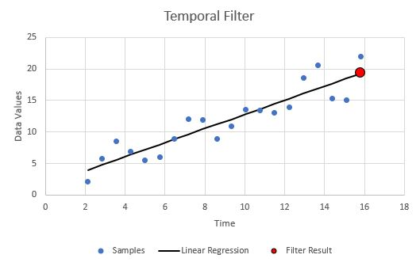

Temporal Data Filter
====================

Temporal filter for the Arduino ecosystem used to process data and time pairs.

 
Filtering is performed by creating a least-squares linear regression through the data.



The resulting value can be either the point on the linear regression at the time of the most recent sample, or a different time that is passed as an argument.  Care is taken to eliminate recomputation if functions are called without adding new data that might change the output.  

Time is expected to be a float datatype with the library making no assumptions of units.  It is up to the user to convert typical unsigned long int time functions (milis() or micros() ) to a reasonable float time scale.
   
Object Creation:
```
TemporalFilter myFilter( filter_Size );
```

`filter_Size:` Number of samples in the filter window.  Larger sizes improve filter smoothness but increase computational time and response lag.

Add data to the filter:
```
myFilter.dataIn( float new_time, float new_data );
```
Adding data has a very low time cost as none of the computations are done at this step.  This allows for sampling data at a high rate, but only performing the filtering as needed.

Get filter result:
```
float filtered_value = myFilter.filterResult();
float extrapolated_value = myFilter.filterResult( some_future_time );
```
This is where the linear regression happens, so it is the most expensive operation in this filter.  Calling this multiple times in a row has minimal cost after the first time as the resuls are not re-computed until new data is added.

Additionally the average of all time or data in the filter can be accessed:
```
float average_data = myFilter.getAvgData();
float average_time = myFilter.getAvgTime();
```
The `getAvgData()` function is identical to a windowed average filter.  If this is called without first calling `filterResults()` only the minimum needed for this output is generated.
